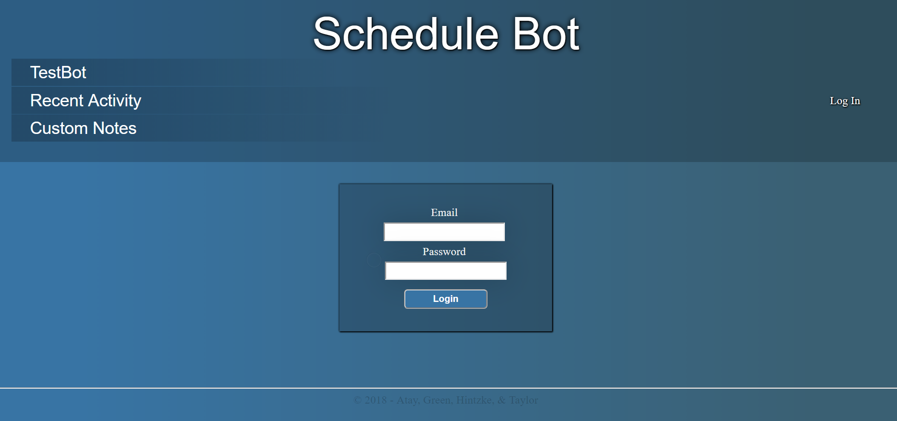
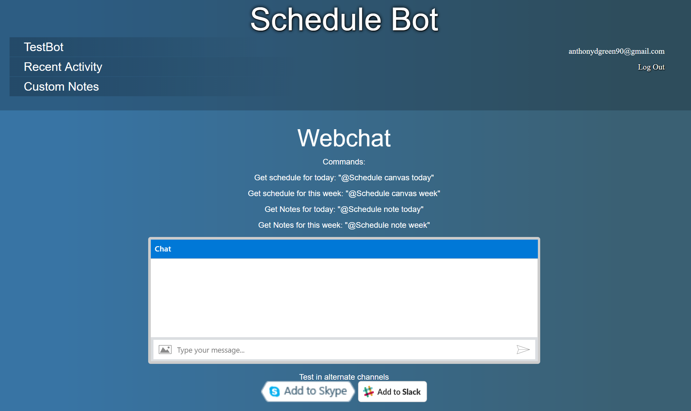
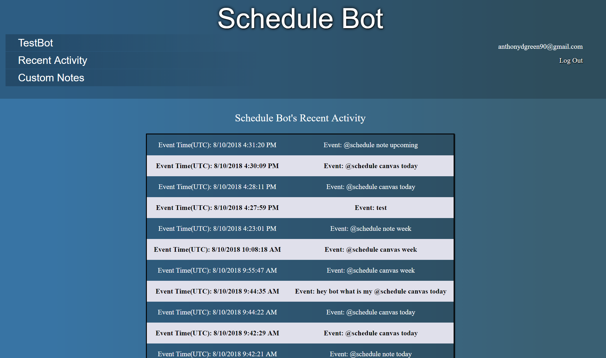
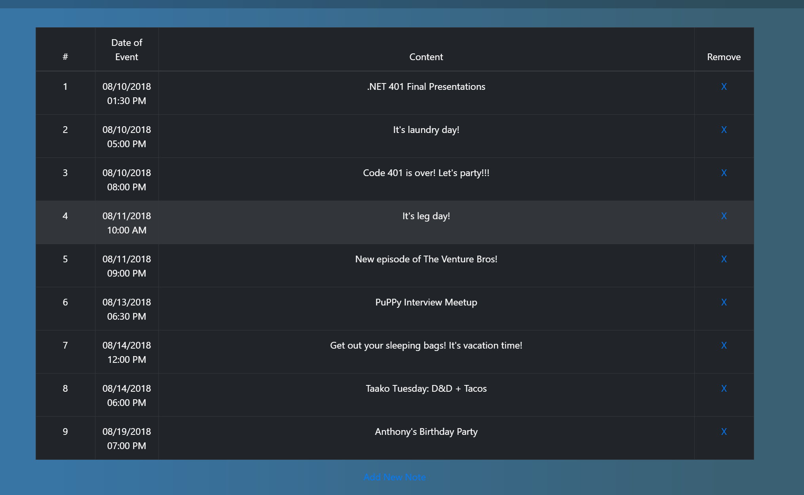
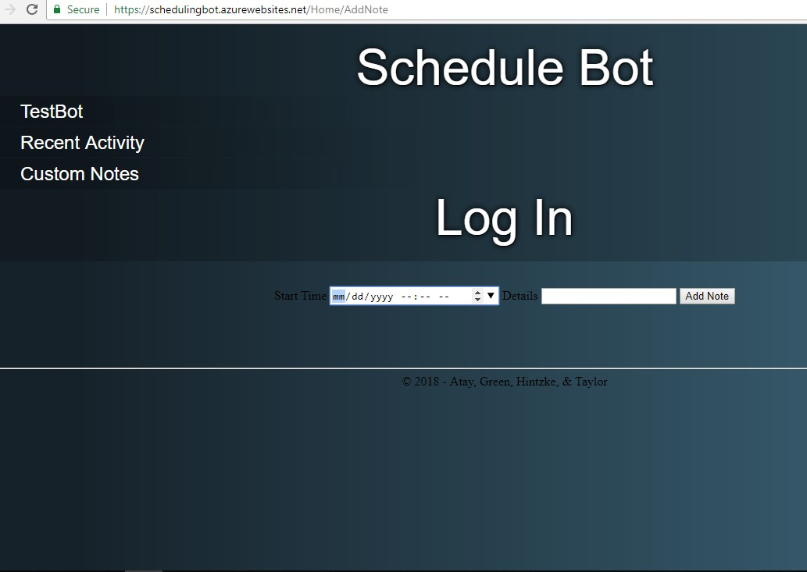
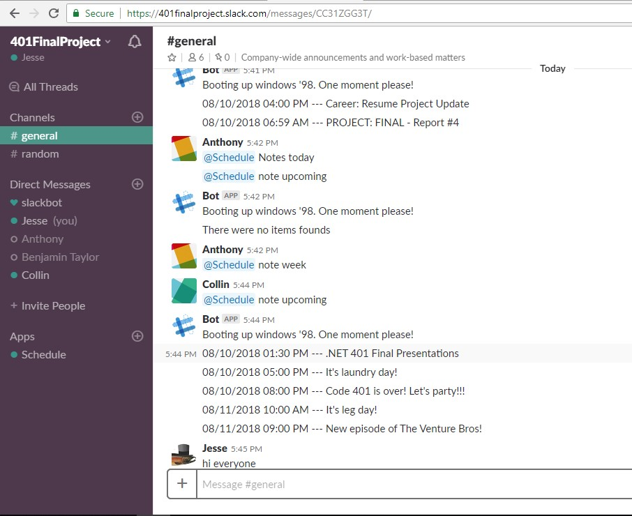

# Introduction 
ScheduleBot uses Azure Bot Services to provide a natural language interface for read operations from an external database.
ScheduleBot allows users to quickly request and subsequently display future tasks and events from the database. 
Our vision is to make navigating our oftentimes hectic everyday lives as painless as possible.  

## Technical Requirements

[Requirements Document](https://github.com/ScheduleBot/ScheduleBotApp/blob/bot-name-fix/requirements.md)

## Wireframes

## Database Schema

The database will have two tables: a table of schedules, and a table of schedule items. Each schedule in the schedules table will have an ID, a foreign key pointing to the user that owns it, and the schedule's name. Each schedule item contains an ID, a foreign key pointing to the schedule it belongs to, the title of the item, the day that the event takes place (if the schedule item does not repeat), the time of day the event starts, how long the event will last, and a set of flags determining which days (if any) the event will occur on each week.

## Admin Site Location

The front-end Admin site is located at the url: https://schedulingbot.azurewebsites.net/Account/Login

## How to Use: Landing Page

The front-end site for this app is designed to be used by administrators. The bot itself is deployed separately, but from the admin site CRUD functionality has been enabled in notes, and the bot chat commands can be tested, as well as options to embed the bot in different sites it is registered for. When a user arrives at the site, they are immediately redirected to the login page. Right now anyone who registers is granted admin access, the goal for the future is to implement policy restrictions so that only admins are allowed access to the site, and must register via OAUTH. The landing page is to login, or choose another option in the nav bar.

## How to Use: Bot Chat Page

The bot testing page features an embedded web chat iframe window. This allows the user to type into it directly. The list of available commands and embed links are on the page as well. Here, the user can test out the current bot functionality, then use one of the buttons to add it to a Skype or Webchat channel. There are more options available, the bot is currently registered at those two.

## How to Use: Recent Activity Page

The recent activity page displays the latest interactions of the bot. When a message is sent from slack with the bot mentioned, it sends a post to our site internal API. This tracks the UTC date-time stamp and the message that was sent, and stores it in the database. UTC is used as the time due to geographic locations of where the bot could be embedded. For an admin, this information is most useful using Universal Time, which allows all the interactions to be filtered by when they occured, regardless of geographical location.

## How to Use: Notes Page

The notes page allows the user to input a personal note. While the bot receives its primary schedule from the Canvas API, our internal API allows an admin user to create additional notes. In the future, these notes would coincide with a particular class or Slack group. For now they are all stored as part of the same schedule item. This allows the additional commands in chat to retrieve notes in addition to canvas items. The result is that a class using Slack can also have notes particular to the class that are independent of the official schedule. 

## How to Use: Slack Bot

The schedule bot is deployed on Azure, and registered as a workspace bot for slack. It functions through the creation of a bot user in the Slack API. The slack bot functionality is then linked to our Schedule Bot through Slack Tokens on Azure services. This allows the bot to have both bot functionality available to Slack bots, in addition to the base functionality of our bot. When a bot command is executed, it retrieves the information from Canvas API or our site internal API for notes. A time stamp for the request is generated, and the information retrieved is relative to the time requested. For example, if a user asks for the week schedule on a Monday, it will receive the schedule for the next week starting Monday. If the request is made on a Wednesday, it will receive a week of assignments starting Wednesday. This ensures that no past due assignments show up when a user is requesting to know upcoming due dates. With each request or bot mention, a post is sent to our internal API endpoint API/ChatLog/New, which stores the request or conversation snippet in the bot activity database table.

Available commands(web chat):
@schedule canvas day: gets the day schedule from Canvas API
@schedule canvas week: gets the week schedule from Canvas API
@schedule canvas upcoming: gets the next 3 days from Canvas API
@schedule note day: gets the note from our internal API
@schedule note week: gets a week of notes from our internal API

## Licensing

This project is licensed and available via MIT license.
